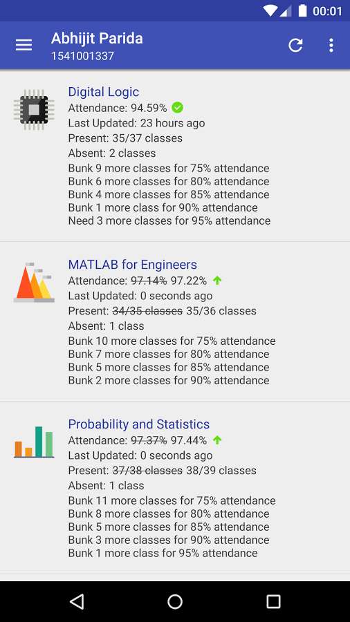

Bunk 
====

Bunk is the unofficial attendance calculator app for ITER.

## License

[MIT](LICENSE)

Android, Google Play and the Google Play logo are trademarks of Google Inc.

Icons from flaticon.com licensed under the Creative Commons BY 3.0 license.
