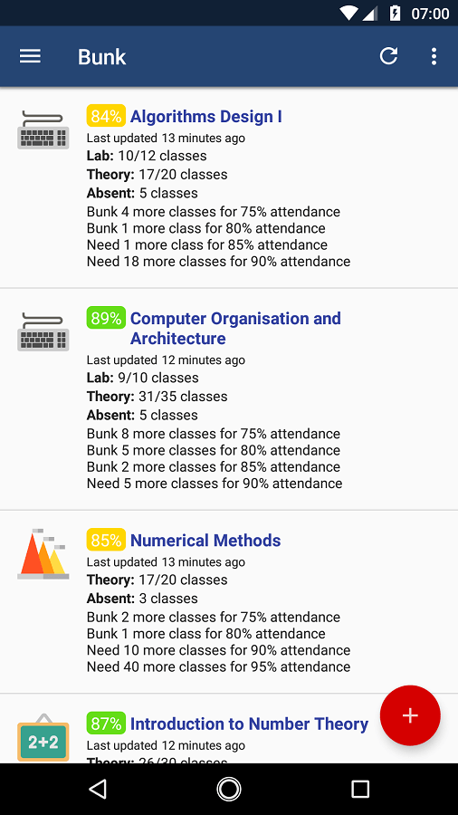

Bunk [](https://travis-ci.org/abhijitparida/bunk)
====

Bunk is the unofficial attendance calculator app for ITER.

[](https://play.google.com/store/apps/details?id=app.abhijit.iter&utm_source=global_co&utm_medium=prtnr&utm_content=Mar2515&utm_campaign=PartBadge&pcampaignid=MKT-Other-global-all-co-prtnr-py-PartBadge-Mar2515-1)



## Contributing

If this is your first pull request, please read this article: [How To Create a Pull Request on GitHub](https://www.digitalocean.com/community/tutorials/how-to-create-a-pull-request-on-github)

### Where To Start

Take a look at the [open issues](https://github.com/abhijitparida/bunk/issues) and pick something to work on. Feel free to open new issues. You can also [search for code marked `TODO`](https://github.com/abhijitparida/bunk/search?q=TODO) in the repo.

Read contributing guidelines here: [CONTRIBUTING.md](.github/CONTRIBUTING.md)

### Debug Build Credentials

```
Username: <your registration number>
Password: password
```

Debug builds are configured not to make API requests to ITER servers. You can use any registration number (provided that it is a 10 digit number) and the password must be `password`.

## License

[MIT](LICENSE)

Android, Google Play and the Google Play logo are trademarks of Google Inc.

Icons from flaticon.com licensed under the Creative Commons BY 3.0 license.
